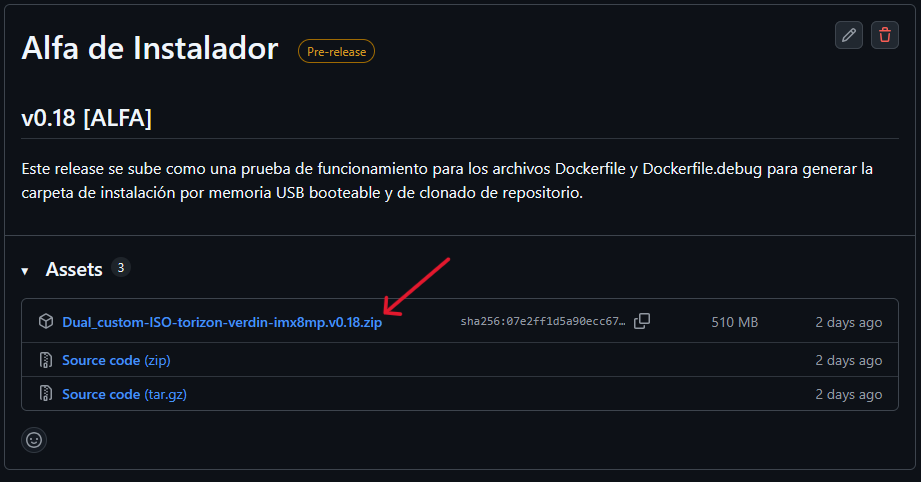
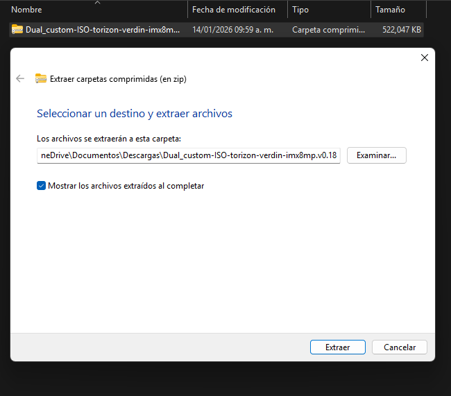
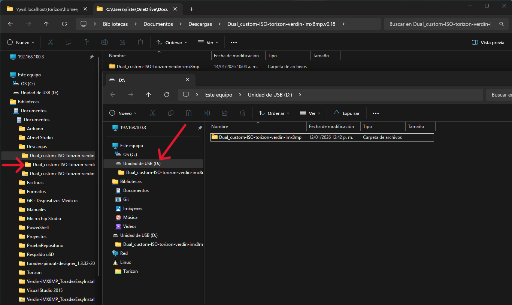
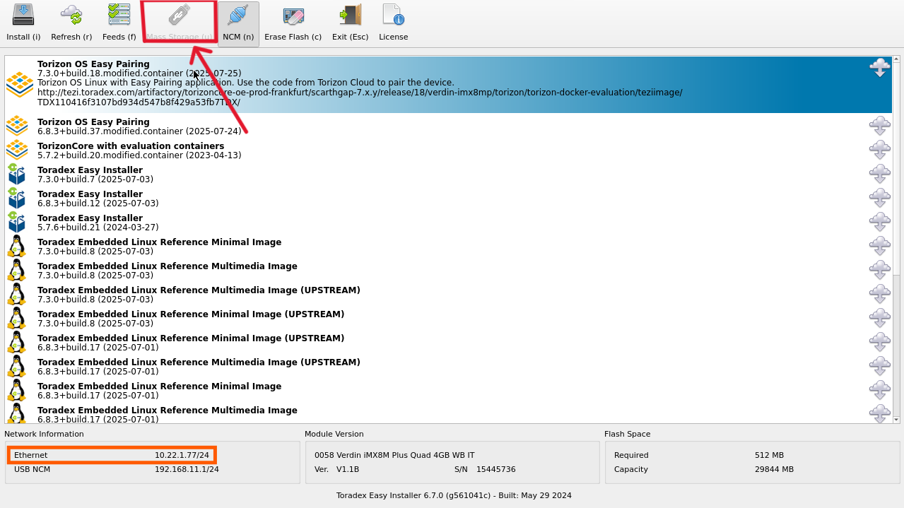
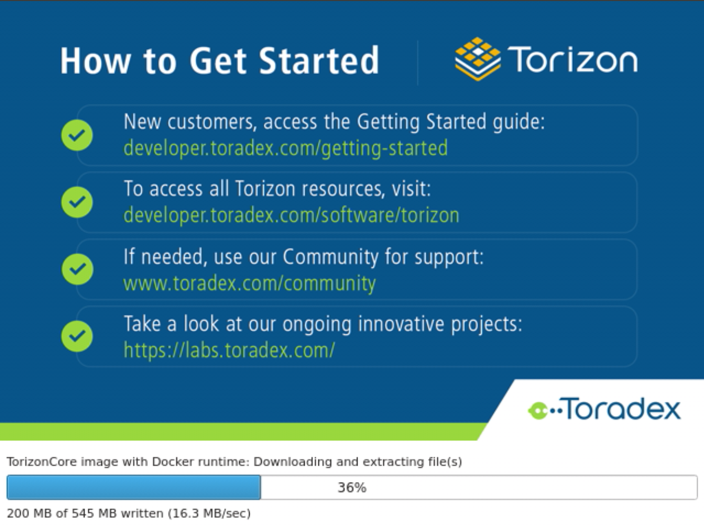

# Proyecto para Torizon Verdin iMX8MP

Este repositorio contiene configuraciones, scripts y/o aplicaciones diseñadas para ejecutarse en la plataforma **Torizon Verdin iMX8MP** de Toradex. Está enfocado en facilitar el desarrollo y despliegue de soluciones embebidas utilizando esta tarjeta basada en ARM Cortex-A53.

## Tabla de Contenidos

- [Características](#características)
- [Requisitos](#requisitos)
- [Estructura del Proyecto](#estructura-del-proyecto)
- [Documentación](#documentación)
- [Control de Versiones](#control-de-versiones)

## Características

- Compatible con TorizonCore y Debian.
- Compatible con Docker y TorizonCore Builder.
- Comunicación con periféricos vía I2C, SPI, UART, GPIO.
- Desarrollo de backend en Python.
- Desarrollo de frontend en HTML/CSS/Javascript.

## Requisitos

- Tarjeta **Verdin iMX8MP** con TorizonCore instalado.
- Cable USB C (para transferencia de archivos) y conexión Ethernet.
- Toradex Easy Installer.
- TorizonCore Builder.
- Visual Studio Code con extensiones de Torizon.
- Docker y Docker Compose instalados.
- Python 3.x y GCC para desarrollos en C y Python.

## Estructura del Proyecto
```
.
├── README.md                                             # Información y Control de Versiones del proyecto
├── doc                                                   # Documentación de Instalación y Funciones
│   ├── Primeros pasos.md
│   ├── Generar imagen ISO.md
│   ├── Funciones.md
│   └── Funciones WEB.md
│
├── tcbdir                                                # Archivos para crear la imagen booteable
│   ├── device-trees
│   ├── dt-bindings
│   ├── linux
│   ├── Overlays                                          # Archivos para modificar el funcionamiento del sistema
│   │   ├── imx8mp-pinfunc.h
│   │   └── verdin-imx8mp-qspi-gpio.dts
│   │
│   ├── docker-compose.yml
│   ├── logo.png                                          # Imagen que se muestra al iniciar el equipo
│   ├── tcb-env-setup.sh
│   ├── tcbuild.yaml                                      # Archivo de configuración de la imagen
│   └── torizon-core-docker-verdin-imx8mp-Tezi_X.X.X+build.XX
│
├── docker-compose.yml                                    # Configuración de los contenedores
├── Dockerfile                                            # Configuración del directorio del proyecto (Producción)
├── Dockerfile.debug                                      # Configuración del directorio del proyecto (Debug)
├── requirements-debug.txt                                # Paquetes de instaladores para el proyecto
├── requirements-local.txt
├── requirements-release.txt
│
└── src                                                   # Código fuente
    ├── main.py                                           # Aplicación principal
    │
    ├── api                                               # Funciones de Comunicación
    │    ├── files
    │    │    ├── logs.py
    │    │    └── tendencias.py
    │    │
    │    ├── com_SPI.py
    │    ├── com_UART.py
    │    ├── pins_ADC.py
    │    └── pins_PWM.py
    │
    ├── dev                                               # Funciones de Control de Dispositivos
    │    ├── Bascula
    │    │    └── bascula.py
    │    ├── Controles
    │    │    └── joystick.py
    │    ├── Fototerapia
    │    │    └── ctrl_Fot_Exam.py
    │    ├── GPIO
    │    │    ├── botones.py
    │    │    ├── calefactor.py
    │    │    └── modoFunc.py
    │    ├── Sensores_TPH 
    │    │    └── bme280.py
    │    └── Temperatura
    │         └── sonda.py
    ├── i2c
    │   ├── at18_T2s.py
    │   └── sht21.py
    │
    └── web                                               # Pagina WEB con la información de los sensores 
        ├── static 
        │   ├─ css                                        # Hojas y variables de estilos
        │   │  ├─ vars.css
        │   │  └─ style.css
        │   │
        │   └─ js									      # Archivos de funciones para la pag WEB
        │      ├─ main.js
        │      ├─ ui.js
        │      └─ sensor.js
        │
        └── templates 
            └─ index.html                                 # Página principal
```

<p align="center">
    
</p>

## Documentación

- [Primeros pasos](./doc/Primeros%20pasos.md)
- [Funciones](./doc/Funciones.md)
- [Funciones Web](./doc/Funciones%20Web.md)
- [Generación Imagen Booteable](./doc/Generar%20imagen%20ISO.md)

## Control de Versiones

### v0.1 - [9/May/2025]

- Habilitación del bus SPI.
- Configuración del archivo torizonPackages.json para instalar la libreria "python3-spidev".
- Configuración del contenedor (docker-compose.yml) para enlazar el bus SPI1.0 con la biblioteca spidev.
- Configuración de la comunicación SPI en Modo 1 a 500kHz.

### v0.2 - [12/Mayo/2025]

- Configuración del bus I2C.
- Configuración del contenedor (docker-compose.yml) para enlazar el bus I2C-3 con la biblioteca smbus2.
- Lectura del sensor SHT21.

### v0.3 - [13/Mayo/2025]

- Configuración de GPIO 1 y 2 de Carrier Board Mallow y Line 4 y 5 de tarjeta Verdin iMX8MM.
- Configuración del archivo torizonPackages.json para instalar la libreria "python3-libgpiod".
- Configuración de contenedor (docker-compose.yml) para enlazar los buses gpiochip2 y gpiochip4 para usar los GPIO_1 y GPIO_2.
- Comunicación con el sensor HX711, se requiere de un level-shifter de 1.8v (Tarjeta Verdin + Mallow) a 3.3v (HX711) para lectura.

### v0.3.1 - [14/Mayo/2025]

- Modificación de SPI para trabajar con BME280.

### v0.3.2 - [19/Mayo/2025]

- Separación del código en módulos para cada sensor.
- Uso de TXS0108E para ajustar el nivel de voltaje entre el módulo HX711 (3.3v) y la tarjeta de desarrollo Verdin + Mallow (1.8v).
- Lectura de celdas de pesaje.

### v0.4 - [20/Mayo/2025]

- Uso de pines ADC para lectura de posición de joystick HW-504.

### v0.5 - [20/Mayo/2025]

- Prueba de levantamiento de servidor local.
- Instalación de librería Flask.
- Funcionamiento en local.

### v0.5.1 - [28/Marzo/2025]

- Se puede acceder a la pagina WEB desde la PC conectada en la misma red.
- Cambio de home.html por index.html.
- Creado directorio "web" dentro del directorio "src" para las plantillas UI/UX. 
- Creado directorio "static" y "templates" dentro del directorio "web" para las plantillas html. 
- Se separaron index y style.
- Agregado despliegue de sensores conectados en la pagina WEB.

### v0.5.2 - [29/Marzo/2025]

- Configurado contenedor Chromium.
- Visualización de la página de Toradex como previsualización.

### v0.6 - [29/Marzo/2025]

- Configurado archivo docker-compose para acceder a la aplicación de manera local.
- Visualización en pantalla LCD-MIPI de página web de la aplicación.

### v0.6.1 - [30/Marzo/2025]

- Actualización en index y main para ver los datos de los sensores en tiempo real.
- Creación de script de javascript para la lectura de sensores.
- Actualización de UI HTML.
- Ajustada resolución de la pantalla a 1024 × 600.

### v0.6.2 - [9/Junio/2025]

- Cambio de weston-imx8:4 a weston-vivante:2 por error de compatibilidad (Queda comentado por si es necesario cambiarlo)

### v0.6.3 - [11/Junio/2025]

- Implementación de gráficas de tendencias de temperatura.

### v0.7 - [17/Junio/2025]

- Cambio de interfaz de pantalla de sensores.
- Ajustados valores a contenedores de Temperatura y Temp. Prog.
- Habilitación y deshabilitación de botones de "+", "-" y "✓".
- Agregada función de aumentar y disminuir la Potencia del Calefactor.
- Añadida animación de parpadeo en el valor de la potencia al dar click en el botón de calefactor y se detiene al dar click en el botón de "✓".
- Limitación de aumento y disminución de valor de potencia de 0 - 100%.
- Corregido bug de guardado de valores de temperatura.

### v0.8 - [2/Julio/2025]

- Guardado de valores de tendencias de Temperatura en archivo json.
- Cambio de color de valor de temperatura al superar los 40.0°C
- Monitorización de memoria y función de limpieza.
- Creación de entrypoint para auto-inicialización de aplicación.
- Control de PWM para fototerapia.

### v0.9 - [4/Julio/2025]

- Agregada microSD para almacenado de datos de tendencias y variables de entorno.
- Lectura de datos como respuesta del documento json e implementación de función de limpieza de datos de archivo json.
- Implementación de variables de entorno para calibración y elección de dispositivos I2C.
- Agregada libreria logging para registro de eventos.

### v0.10 - [8/Julio/2025]

- Correción a la ruta de montaje de microSD.
- Implementación de función de calibración del módulo sht21.

### v0.10.1 - [8/Julio/2025]

- Agregado cambio de valor dependiendo del botón selccionado.
- Creadas funciones de taraje y calibración (**No estan probadas**).

### v0.11 - [28/Julio/2025]

- Agregadas animaciones a los botones de los módulos de sensado.
- Agregadas animaciones a los botones superiores.
- Agregando logs a funciones de main y flask.
- Prueba realizada sin microSD. Se continuan escribiendo los archivos logs y tendencias.
- Añadida gráfica de tendencias y botones de almacenamiento de tendencias.
- Prueba de funcionamiento en nuevo HW. (La tarjeta microSD debe conectarse antes de encender el sistema. Esta debe tener el formato ext4).
- Funcionando botones de Iniciar Registro de Datos y Detener Registro de Datos.
- Pruebas realizadas de nivel de Fototerapia y luz de Examinación.
- Creada función para interrupción de apagado de equipo y detención de servicios.
- Formulartio para ingerso de nombre de paciente.
- Cambio de HW-504 por lectura ADC de sondas de piel.

### v0.12 - [25/Agosto/2025]

- Correcion de bugs de lectura de Sonda de piel, Celda de pesaje, Niveles de luz de fototerapia y examinación.
- Comentados los logs.
- Modificada función de botón PWR para que incrememnte un contador y si pasan 30 segundos sin presionarse el botón el contedor se reinicia a 0.
- Prueba de led de botón PWR.
- Cambio de puertos I2S (Serial Audio) a GPIO.
- Control de calefactor por PWM en GPIO con lógica inversa.
- Canal de retroalimentación de GPIO para analizar el estado de la señal.
- Implementada retroalimentación de valor de la potencia del calefactor.

### v0.13 - [8/Septiembre/2025]

- Timeout para ajuste de potencia de calefactor. Si no se modifica en por lo menos 60 seg este se desactiva.
- Habilitada comunicación UART.
- Creada sección para despliegue de información de mensaje UART.
- Ajuste a la alerta por desconexión de calefactor.
- Cambio de velocidad de comunicación UART a 115200 bauds.
- Lectura de sonda de piel desde tarjeta BCD por UART.
- Lectura de tarjeta de báscula via I2C.
- Encontrado error en la comunicación con tarjeta de 2a Sonda.

### v0.14 - [12/Septiembre/2025]

- Conectividad con Tarjeta de Bescula.
- Lectura de peso en Kg.
- Actualización de control de Luz de Fototerapia y Luz de Examinación.
- Conexión con Tarjeta de Segunda Sonda.
- Creada función para probar comunicación UART con tarjeta de báscula.
- Implementación de trama de comunicación con CRC-16 ARC.

### v0.15 - [27/Octubre/2025]

- Implementado Reloj en tiempo real.
- Agregados botones de Calibración y Taraje a la báscula. (En pruebas).
- Implementado Máquina de Estados de Cambio de Modo de funcionamiento de Cuna => Incubadora e Incubadora => Cuna.
- Asignación de pines para sensores y actuadores para el cambio de modo de funcionamiento.

### v0.16 - [5/Octubre/2025]

- Corrección de bugs de maquina de estados de cambio de modo de Funcionamiento.
- Agregados botones para cambio de modo en interfaz web.
- Notificación de pantalla completa de status de cambio.
- Creados botones de Altura Variable, Altura de Lámpara e Inclinación de Bacinete.
- Asignado pines para multiplexar el funcionamiento entre Cambio de Modo de Operación, Altura Variable, Altura de Lámpara e Inclinación de Bacinete.
* *Comentada función de multiplexeo y reasignados pines como contrl para la Tarjeta CAV para pruebas*

### v0.16.1 - [11/Noviembre/2025]

- Revisión de función de pesaje.
- Correción de bugs de funciones de báscula.
- Agregado valor de toleracia para calibrar (+/- 0.100 [kg]).
- Ajuste de tiempos de Pesaje, Taraje y Calibración.
- Implementados mensajes de Calibración y Tara.

### v0.16.2 - [20/Noviembre/2025]

- Cambio de las funciones de comunicación con los motores de Altura variable, Inclinación de Bacinete y Altura de la lámpara.

### v0.17 - [10/Diciembre/2025]

- Actualización de Interfaz WEB para cambio de Interfaz.
- Cambios al Footer para que los campos de texto sean dinámicos.
- Ajustes al tamaño de la pantalla y a los márgenes.
- Cambios a los botones superiores para ahora tener el indicador de Modo (Cuna/Incubadora), Alarmas y Bloqueo/Desbloqueo.
- Rediseño de los paneles de Información y sección de botones.
- Nuevo diseño de los paneles de Información.
- Agregados paneles de modulos deslizables en el lateral derecho.
- Añadidos colores para los títulos de cada módulo.
- Ajuste de tamaño de botones.
- Tamaño y posición de mediciones de módulos laterales estandarizados.
- Actualizadas funciones para guardar información del paciente.
- Creada función de cambio de Modo Bebé/Manual.
- Agregados los colores de indicación de modo activo.
- Añadidas funciones de habilitación / deshabilitación de controles en los paneles principales.
- Agregada función de parpadeo para indicar que se estan modificando valores de Temperatura Programada y Potencia de Calefactor.
- Indicador de barras de Potencia de Calefactor.
- Creado botón y función de sobregiro.
- Toogle sonbre botón de sobregiro.
- Implementada función de botón "Más" y "Menos" de Temperaturta Programada para aumentar y disminuir más rápido al mantener pulsado.
- Implementada función de botón "Más" y "Menos" de Potencia de Calefactor para aumentar y disminuir más rápido al mantener pulsado.
- Funciónes de expandir y contraer los módulos laterales.
- Ajuste de habilitación de modificación de potencia de calefactor al cambiar a modo Manual.
- Centrado de módulos activos..
- Corrección de visualización de potencia de calefactor a 2 dígitos.
- Header desplazado del body a una sección arriba.
- Creada función de bloqueo/desbloqueo de pantalla.
- Añadidas sliders para control de luz de examinación y fototerapia y visualizacion de valores.
- Implementadas funciones de middleware.
- Agregado fecha y reloj.
- Conexión de Frontend y Backend de Temperatura de Sondas Principal y Auxiliar y Temperatura Programada.
- Función de configuración de potencia de Calefactor.
- Funciones para Báscula (Pesar, Tarar, Calibrar).
- Agregada función de Cronómetro Apgar.
- Agregada función de Cronómetro para Fototerapia.
- Función de comunicación de controles de posición de equipo.
- Función de cambio de Modo de Operación.
- Retirada función de seleccionar con presionado largo en la interfaz web.
- Agregado mensaje de alarma con color por prioridad.
- Agregada funcionalidad de gráfica de temperatura. Botones de Inicio, Detener y Limpiar corregidas la funcionalidad para solo permitir limpiar los datos cuando este detenido el guardado.
- Creado diagrama de bloques de comunicación de tarjeta Verdin con dispositivos externos.
- Corrección de edición de Valor de Temperatura Programada y de Potencia de Calefactor. Se activaban cuando estaba bloqueado.

### v0.17.1 - [23/Diciembre/2025]

- Cambio de privacidad de repositorio.
- Documentación de funciones.
- Corrección de función de lectura de Sonda para recibir como parámetro el canal ADC.
- Corrección de función de visualización de valores de temperatura. Si no existe un valor se muestra "--.-".
- Documentación de funciones ya probadas con Docstring.

### v0.18 - [12/Enero/2026]

- Corrección de archivos Dockerfile para crear imagen booteable en memoria USB.
- Documentación de Primeros pasos, Funciones y Creación de Imagen booteable.

### v0.19 - [15/Enero/2026]

- Cambio de función de pines QSPI a GPIO.
- Cambio de UART2 a UART1.
- Cambio de función de CAN2 a GPIO.

### v0.20 - [26/Enero/2026]

- Configuración de pines GPIO extensión secundaria como controles de motores y sensores de Cuna/Incubadora.
- Reconfiguración de boton de encendido (función de configuración) y led de notificación.0
- Agregadas funciones de control de Joystick (Simulación de una probable adición de encoder de control de GUI).
- Agregados canales UART 2 y 3 para usarse en el futuro (Canalaes 3 y 4 requieren desoldar resistencias de USB debug y soldarlas en los canales de pines GPIO).
- Creadas funciones para mover y seleccionar los elementos de la interfaz con un jotstick.
- Agregada función de Sensado de Oxigeno por canal 2 del ADC.

### v0.20.1 - [3/Febrero/2026]

- Modularizadas APIs y Funciones de comunicación con tarjetas principales.
- Nuevo árbol de proyectos.
- Separado en carpeta "api" para funciones de comunicación entre tarjetas y sistema, y carpeta "dev" para dispositivos que hacen uso de las funciones.
- Corrección de control de fototerapia. La fototerapia no enciende si la luz de examinación no está encendida.
- Control de sliders de Fototerapia y Luz de Examinación por joystick.
- Muestra de la versión de Firmware al hacer 10 toques sobre la fecha y hora.

### v0.21 - [3/Marzo/2026]

- Implementada función de desconexión de sumninistro eléctrico.
- Creada alerta continua hasta que se reconecte.
- Lectura de encoder para modificar Temperatura programada.
- Agregados módulos de MPU6050 para sensado de inclinación de bacinete.
- Creadas funciones de lectura y calibración.
- Implementada función de Posición 0.

### v0.22.1 - [3/Marzo/2026]

- Creados los contenedores y componentes de la pagina principal de la UI.
- Asignados ids para control de interfaz.

### v0.22 - [18/Junio/2026]

- Pruebas de comunicación Verdin-UART de sensores y controles de temperatura, oxigeno y humedad.
- Agregado byte de alarmas. *Versión MCU_control-18062026*
- Envío de valores de sensado de: t_Aire, t_Piel, s_Aux, ta_Ctrl, basc, pot_Calef, tp_Ctrl, s_Ox, ox_Ctrl, s_Hum, hum_Ctrl, fot_Hrs, fot_Mins, zero, alrm

### v0.23 - [13/Julio/2026]

- Pruebas de integración de encoder de 24 pasos con acopladores de nivel de 1.8 -> 5 -> 1.8 volts.
- Limitación inferior y superior de valores para temperatura programada.
- Envío del valor a la interfaz y control de la habilitación, desde la UI WEB.
- Asignado tiempo de rebote para el click del botón del encoder y evitar falsos clicks.
- Creado control y animación para encoder.
- Modularización de función para comunicación UART - TCD.
- Estructuras de datos para valores de control y de sensado.

### v0.23.1 - [22/Julio/2026]

 - Animación de presionado de botones del menú inferior.
 - Removido grafico indicador de potencia en el panel de control debido a incompatibilidad entre valores de temperatura y potencia.
 - Cambio de panel de control a home al aceptar el valor desde en switch del encoder.
 - Pruebas de comunicación con TCD con FW MCU_control_17072026.hex.
 - Corrección de despliegue de valores de potencia sin decimales.
 - Control de valores de programación de TCD (FW TCD: MCU_control_22072026).

 ### v0.23.2 - [31/Juliio/2026]

 - Ajuste de gráfico para distintos valores de control y diferentes limites mínimo y máximo.
 - Titulos de paneles de control cambian de acuerdo al panel.
 - Indicador de módulos laterales activos en panel de control.
 - Agregado colores de segmentos de gráfico inactivo.
 - Color independiente de cada slider para indicar el valor de control del panel.
 - Agregado panel de cronómetro APGAR.
 - Correción a funcionamiento visual de botones inferiores.
 - Agregado panel Modo Familiar.
 - Creado slider para fototerapia.
 - Añadido panel de báscula.
 - Control de Intensidad de fototerapia.
 - Cambio de titulo de "Ajuste de Potencia de Fototerapia" por "Ajuste de Intensidad de Fototerapia".
 - Funcionamiento de cronómetro Apgar.
 - Animación de botones de Play/Pause y Reset de conómetro.
 - Animación slider de cronómetro Apgar.
 - Corrección de bug visual de botones.
 - Animación slider timer de función Tarar de Báscula.
 - Animación de panel lateral módulo de báscula.
 - Módulo de pesaje agregado.

### v0.23.3 - [11/Agosto/2026]

 - Cambio de paneles de función "click" a "touchstart" y "touchend".
 - Cambio de paneles de "ui.js" a "app.js".
 - Corrección de estilos visuales de botones inferiores.
 - Cambio de color a los paneles al tocarlos.
 - Creado panel para aceptar el ajuste de fototerapia.
 - Sección T. Piel modo desactivado acomodado.
 - Primera versión de modo aire. Hay que optimizar el cambio de función.
 - Función de obtención de fecha y hora.

## Descarga e Instalación

<p align="center">
	<a href="https://github.com/LESerrB/Torizon_Verdin/releases">
		
	</a>
</p>

1. Descargar el archivo .zip de la versión deseada del repositorio.


2. Descomprimir la carpeta.


3. Copiar el contenido de la carpeta en la raiz de la memoria.


4. Insertar la memoria durante la interfaz EasyINstaller en la tarjeta SoM y seleccionar "Mass Storage".

En caso de necesitar volver a cargar la ISO del sistema es necesario reiniciar de fábrica la tarjeta siguiendo los pasos descritos en: https://developer.toradex.com/easy-installer/toradex-easy-installer/loading-toradex-easy-installer/?module=verdin_imx8mp&carrier=dahlia#windows

5. Esperar a que termine la instalación.


6. Reiniciar el equipo (Tarjeta y pantalla).
