# Primeros Pasos con Torizon y Verdin

## Instalación de la SoM

Para instalar la tarjeta Verdin se debe insertar en la placa en un slot SODIMM en un ángulo de 30° hasta que se oiga un click.

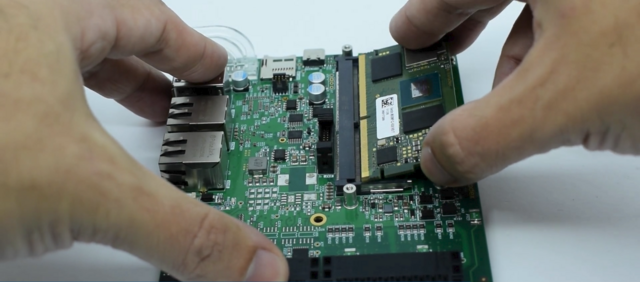

Bajar la tarjeta hasta que los clips queden en su lugar, colocar los tornillos de soporte.

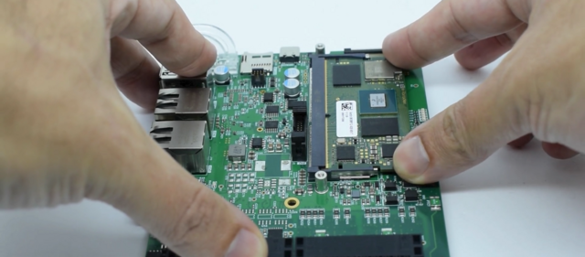

Enchufar los cables de alimentación, cable de red y HDMI. Opcionalmente conectar el cable USB C si se necesita usar el Recovery Modoe.


Encender la tarjeta presionando el boton ON/OFF.


Despues del primer inicio se verá el GUI de Toradex Easy Installer. (Si no se visualiza la GUI en la pantalla usar VNC para comprobar que este funcionando correctamente)

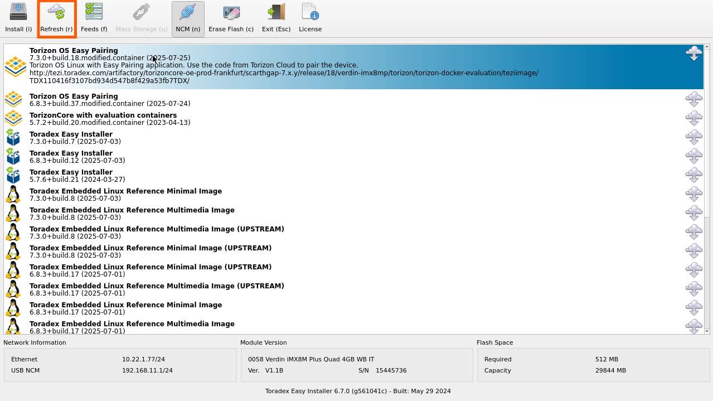

## Instalación del SO

Ubicar el modelo y número de serie en la tarjeta (Fig. 9). Estos se usarán para crear el nombre host de la tarjeta Ej. [familia]-[procesador]-[número-serie] (verdin-imx8mp-xxxxxxxx)

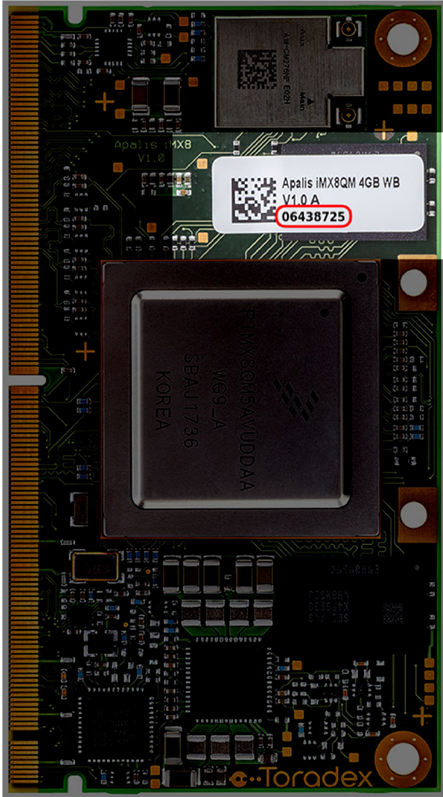

Usar Advanced IP Scaner (O software similar) para encontrar la dirección IP dentro de la red. Los números de la etiqueta deben corresponder a los que aparecen en el software.

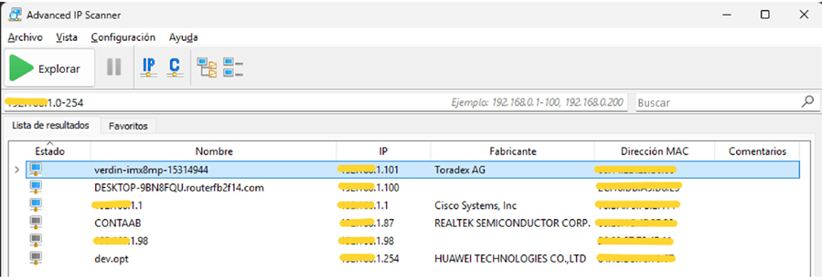

Abrir RealVNC Viewer e iniciar una nueva conexión. En VNC Servver colocar la dirección IP obtenida con el software.

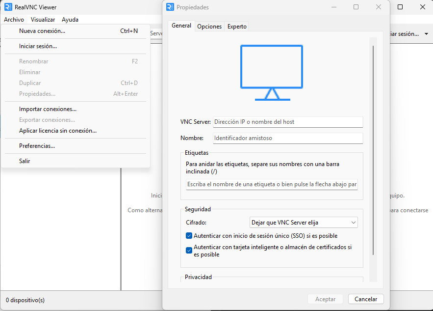

En la pantalla de EasyInstaller seleccionar la versión 6.8

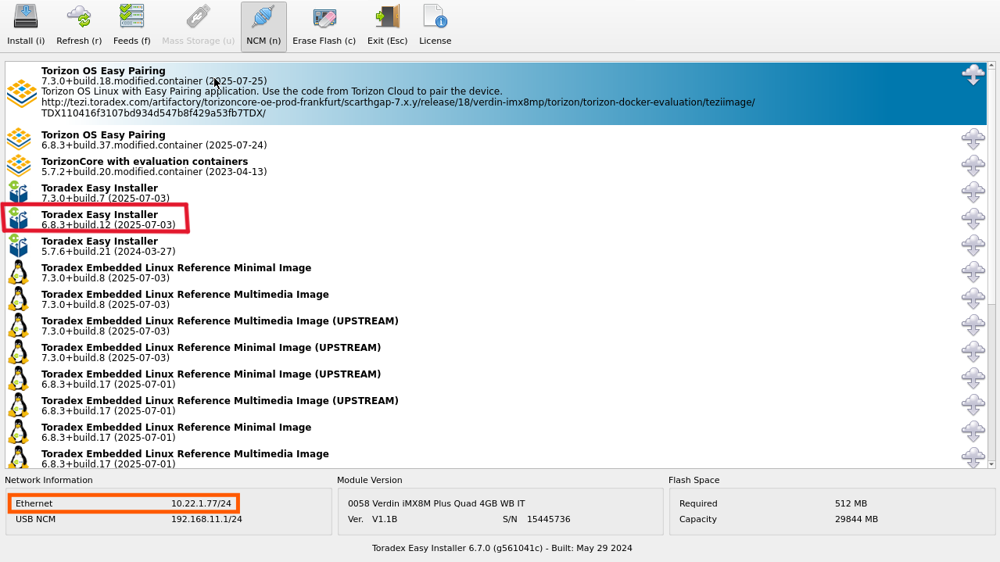

Esperar a que el instalador termine.


Cuando termine, el sistema debe reiniciarse. Si se usa VNC la conexión se perderá y necesitará reinicar manualmente con el botón de Reset u On/Off.

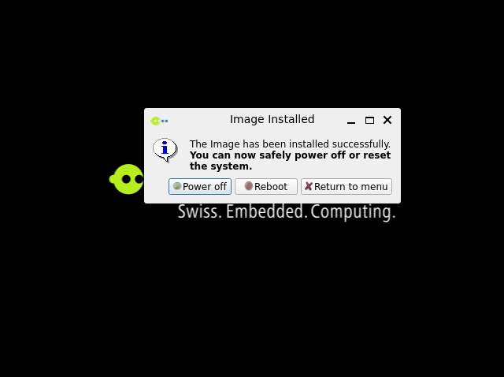

## Configuración VS Code

Dar click en el icono de Extensiones del lado izquierdo en VS Code

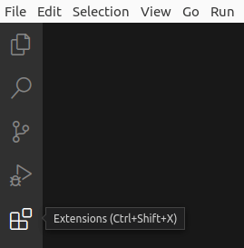

Buscar e instalar Torizon IDE Extension.

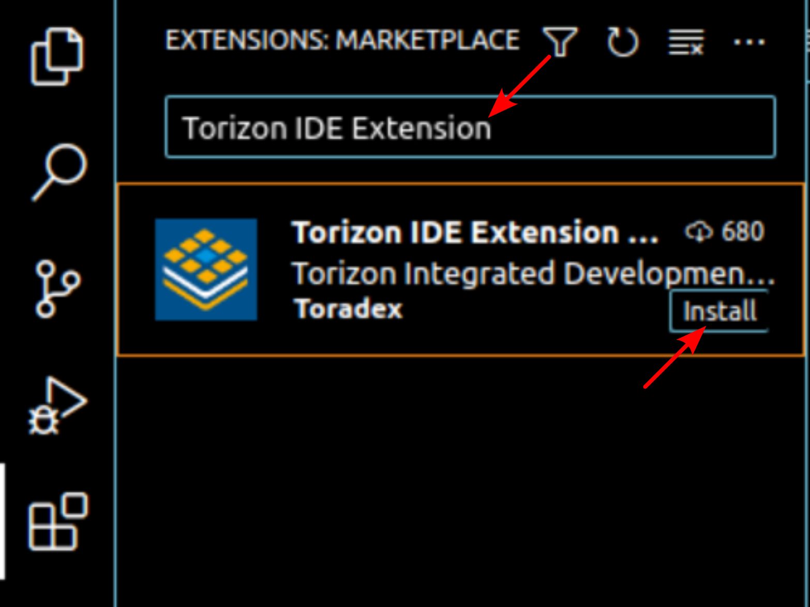

Activar la extensión seleccionando el icono en la barra lateral.

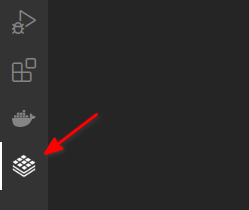

Durante la primer activación se deben verificar e instalar las distintas dependencias necesarias.

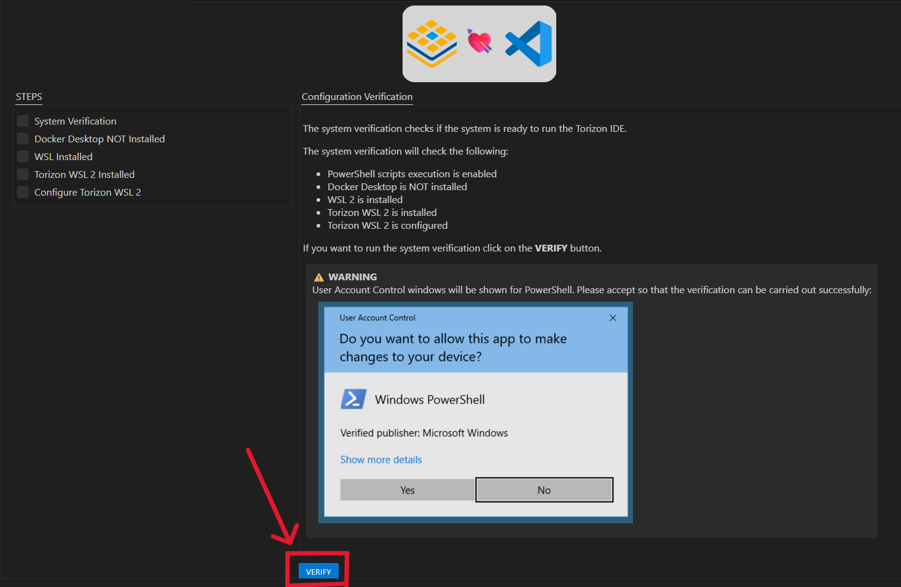

Instalar Windows Subsystem for Linux. El equipo se reiniciará después de la instalación.

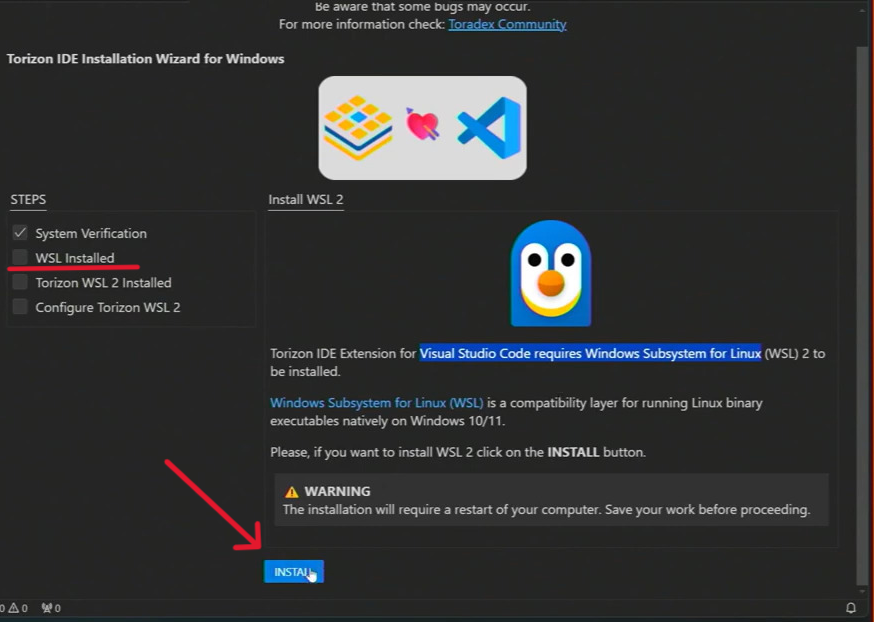

Despues del reinicio, volver a abrir VS Code y ejecutar de nuevo la verificación de las dependencias. Si se han completado las verificaciones anteriores de manera correcta. Instalar Torizon WSL 2.

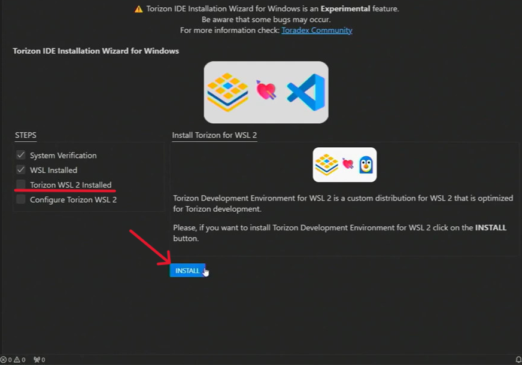

Configurar el entorno de Torizon WSL.

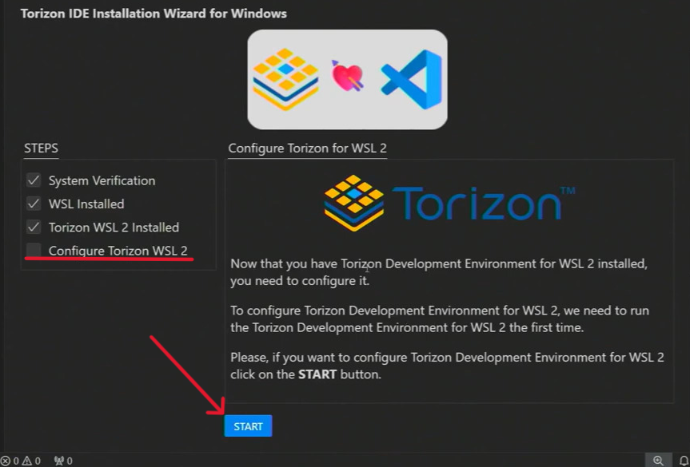
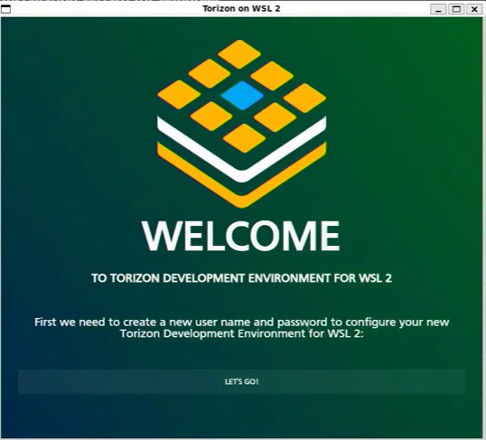

Asignar el Nombre del Sistema y la contraseña ```sudo```

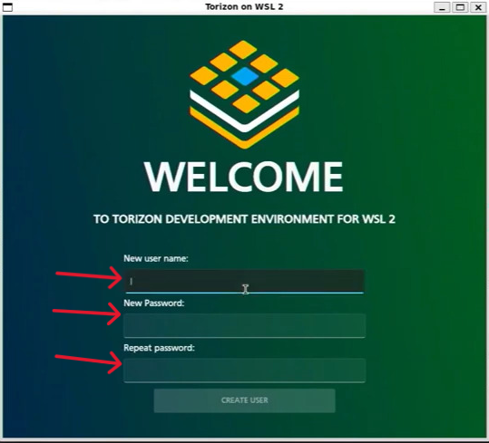

Después de verificar e instalar las dependencias conectar con WSL.

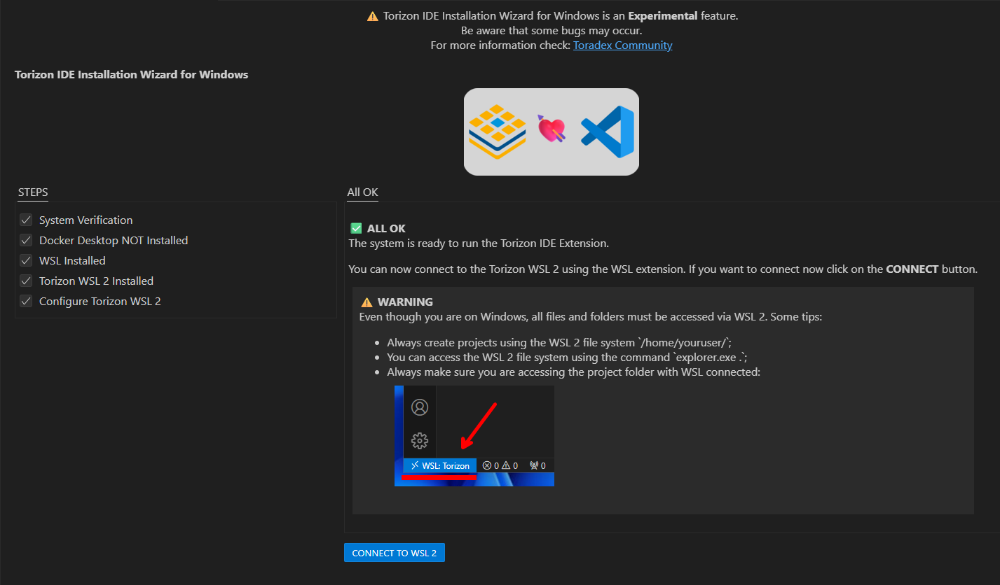

Después de conectar WSL se podrá Abrir/Crear un proyecto de Torizon.

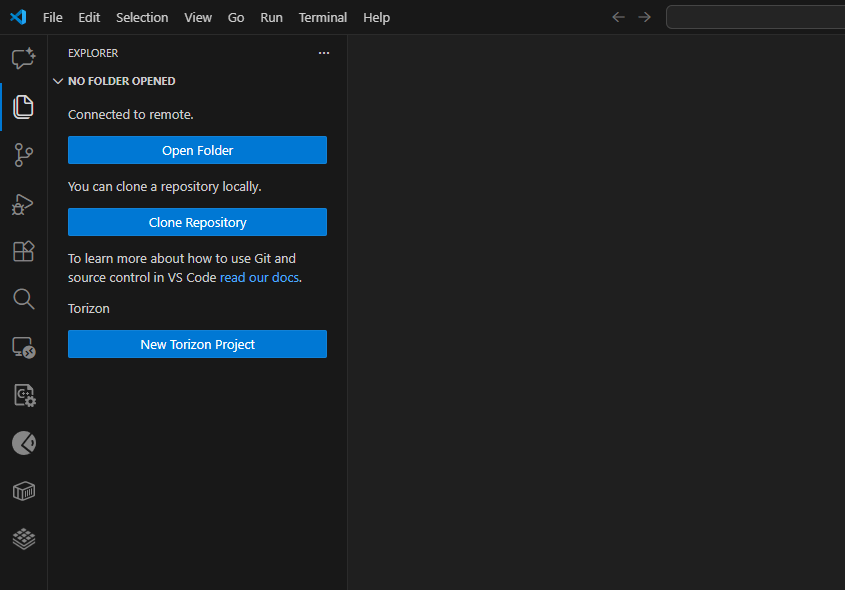

## Construcción del proyecto

Descargar el proyecto en una instancia de WSL.

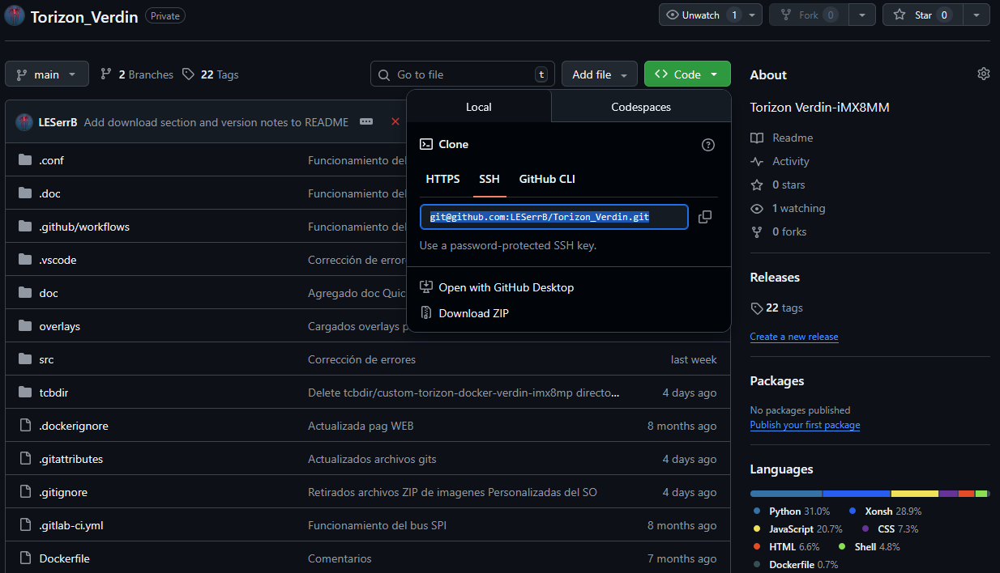
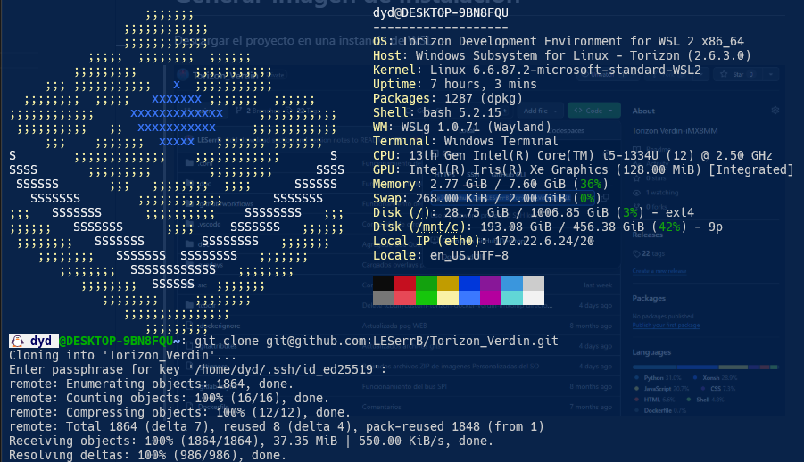

Abrir el proyecto en VS Code y construir el proyecto.

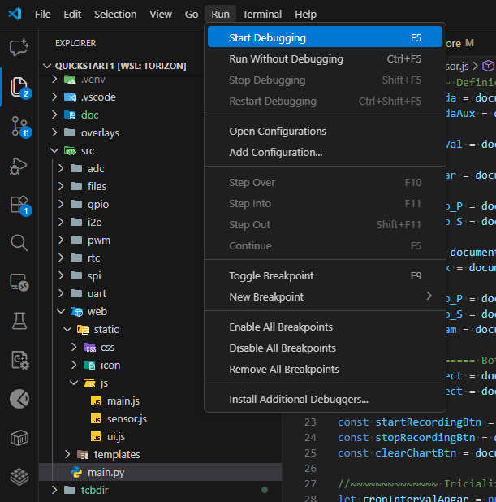

Asegurar que el compilador de VS Code se encuentre como Torizon arm64.

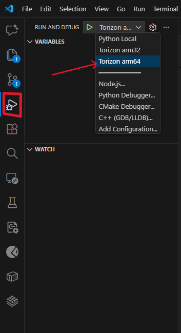

Durante la primer carga del proyecto se pedira instalar los paquetes y recursos necesarios para el proyecto. Usar la contraseña configurada con anterioridad.

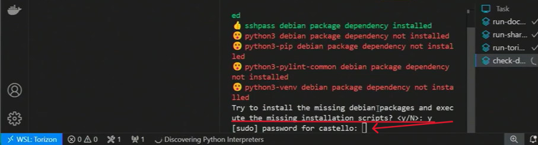